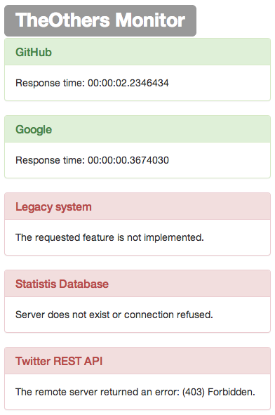

TheOthers
===============
[](https://travis-ci.org/giacomelli/TheOthers)

C# library to monitor all external dependencies of your app. An external dependency or "The Other", can be anything that your current app is depentent, like 
others systems, web apis, web services and databases.

--------

Features
===
 - Add your own external dependency checker implementing [IExternalDependency](src/TheOthers/IExternalDependency.cs) or extending [ExternalDependencyBase](src/TheOthers/ExternalDependencyBase.cs).
 - Base classes for common external dependencies, as:
 	- Database ([DbExternalDependencyBase](src/TheOthers/DbExternalDependencyBase.cs)).
 	- Web ([WebExternalDependencyBase](src/TheOthers/WebExternalDependencyBase.cs)). 
 - Easy find all your dependencies through the [ExternalDependencyService](src/TheOthers/ExternalDependencyService.cs) domain service.
 - Renderize a monitor on your ASP .NET MVC project using basic html or Bootstrap style with just one line of code.
 


--------

Setup
===

`For ASP .NET MVC projects`

PM> Install-Package TheOthers.Mvc

`For any other .NET projects`

PM> Install-Package TheOthers


Usage
===

Creating your external dependency from scratch
---
```csharp
public class LegacySystemExternalDependecy : ExternalDependencyBase
{
	public LegacySystemExternalDependecy () : base("Legacy system")
	{
	}

	protected override ExternalDependencyStatus PerformCheckStatus ()
	{
		var result = new ExternalDependencyStatus();
		
		if(LegacySystemService.Login())
		{
			result.IsFailing = false;
		}
		else {
			result.IsFailing = true;
			result.Description = "Login failed.";
		}
	}
}
```

Creating your external dependency for database
---
```csharp

public class StatisticsDbExternalDependency : DbExternalDependencyBase
{
    public StatisticsDbExternalDependency()
        : base("Statistis Database", "StatisticsDb") // StatisticsDb is the name of connection string on .config file.
    {
    }
}
```

Creating your external dependency for web
---
```csharp
public class GitHubExternalDependency : WebExternalDependencyBase
{
    public GitHubExternalDependency()
        : base("GitHub", "http://www.github.com", HttpStatusCode.OK)
    {
    }
}
```

Discovering all external dependencies
---
```csharp

var theOthers = ExternalDependencyService.GetAllExternalDepencies ();
```

Checking all external dependencies status at once
---
```csharp

var theOthersStatus = ExternalDependencyService.CheckAllExternalDependenciesStatus ();
```

Rendering a TheOthers monitor on your MVC project
---

```csharp

@Html.TheOthers().BootstrapMonitor()

// or

@Html.TheOthers().BasicTableMonitor()
```

--------

Roadmap
-------- 
 - Implement others external dependencies base classes:
 	- WmiExternalDependencyBase
 	- WcfExternalDependencyBase
 	- RestExternalDependencyBase
 - Create a .config section handler to configure some external dependecies.	
 
--------

How to improve it?
======

Create a fork of [TheOthers](https://github.com/giacomelli/TheOthers/fork). 

Did you change it? [Submit a pull request](https://github.com/giacomelli/TheOthers/pull/new/master).


License
======

Licensed under the The MIT License (MIT).
In others words, you can use this library for developement any kind of software: open source, commercial, proprietary and alien.


Change Log
======
 - 0.5.0 First version.
